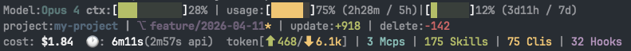

# claude-status-hud

[English](README.md) | [中文](README.zh-CN.md)

Rich status HUD for Claude Code & Codebuddy Code. Cross-platform, zero dependencies.



## What it shows

```
Model:Opus 4 ctx:[████░░░░░░]28% | usage:[████░░]75% (2h29m / 5h)|[█░░░░░]12% (3d11h / 7d)
project:my-project | ⎇ feat/my-branch* | update:+126 | delete:-16
cost: $1.84  🕐: 6m11s(2m57s api)  token[⬆ 468/⬇ 6.1k] | 3 Mcps | 174 Skills | 75 Clis | 32 Hooks
tools:Read×2, Edit
agent:cli, Explore ● running
todo:[█████░░░░░]3/6 (50%) ▸ Fix edge case
```

**Line 1:** Model name, context window usage bar (color-coded: green <50%, yellow <80%, red >=80%), rate limit usage bars with reset countdown (5h / 7d). Shows "For subscribers only" when usage data is unavailable

**Line 2:** Project name, git branch, dirty indicator (`*`), ahead/behind upstream (`↑2 ↓1`), lines added/removed

**Line 3:** Session cost (USD), wall clock duration, API duration, input/output tokens, active MCP servers, installed skills, CLI commands, hooks

**Line 4:** Active tools and call counts (e.g. `Read×2, Edit`) — only shown when tools are running or recently used

**Line 5:** Agent names and running/idle status (e.g. `cli, Explore ● running`) — only shown when agent traces exist

**Line 6:** Todo progress bar with completed/total count, percentage, and the first in-progress task (e.g. `3/6 (50%) ▸ Fix edge case`) — only shown when tasks exist

## Install

### `Claude Code` or `Codebuddy Code`

In a `Claude Code` or `Codebuddy Code` session, run the same commands:

```
/plugin marketplace add CzhJing/claude-status-hud
/plugin install claude-status-hud
/reload-plugins
```

## Update

To update the plugin to the latest version:

```
/plugin update claude-status-hud
/reload-plugins
```

Then re-run `/setup-status-hud` if the status line is not displaying correctly.

## Setup

After installing, run the `/setup-status-hud` command inside Claude Code to auto-configure. If the skill is not found, please exit Claude Code / Codebuddy Code and restart, then try again.

## Requirements

- **Claude Code** v2.1+ or **Codebuddy Code** (with statusLine support)
- **Node.js** (already required by Claude Code / Codebuddy Code)
- **Git** (optional, for branch/status display)

## No external dependencies

This plugin uses only Node.js built-in modules. no additional tools.

Works on **macOS**, **Linux**, and **Windows**.

## License

[MIT](LICENSE)
