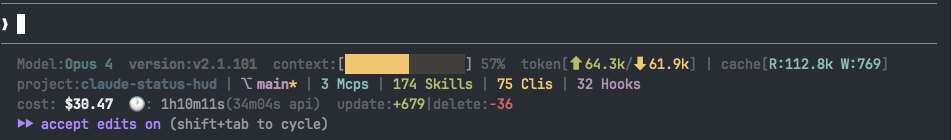

# claude-status-hud

[English](README.md) | [中文](README.zh-CN.md)

Claude Code 富信息三行状态栏插件。跨平台，零依赖。


## 显示内容

```
Model:Opus 4  version:v2.1.101  context:[████░░░░░░░░░░░] 28%  token[⬆ 468/⬇ 6.1k] | cache[R:53.0k W:2.2k]
project:my-project | ⎇ feat/my-branch* | 3 Mcps | 174 Skills | 75 Clis | 32 Hooks
cost: $1.84  🕐: 6m11s(2m57s api)  update:+126|delete:-16
```

**第一行：** 模型名称、版本号、上下文窗口使用进度条（颜色随用量变化）、输入/输出 token 数、缓存读写统计

**第二行：** 项目名称、Git 分支名、未提交修改标识（`*`）、领先/落后上游提交数（`↑2 ↓1`）、活跃 MCP 服务器数、已安装 Skills 数、CLI 命令数、Hooks 数

**第三行：** 会话费用（美元）、总耗时、API 耗时、新增/删除行数

## 安装

```bash
claude plugin add github:BeiShan/claude-status-hud
```

## 配置

安装后，在 Claude Code 中运行 `/setup-status-hud` 命令即可自动完成配置。

也可以手动在 `~/.claude/settings.json` 中添加：

```json
{
  "statusLine": {
    "type": "command",
    "command": "node \"~/.claude/plugins/cache/claude-status-hud/claude-status-hud/1.0.0/scripts/statusline.js\""
  }
}
```

> 请将路径替换为实际的插件安装路径。运行 `/setup-status-hud` 可自动检测。

## 环境要求

- **Claude Code** v2.1+（需支持 statusLine 功能）
- **Node.js**（Claude Code 本身已要求安装）
- **Git**（可选，用于显示分支和状态信息）

## 零外部依赖

本插件仅使用 Node.js 内置模块，无需 `jq`，无需 `npm install`，无需安装任何额外工具。

支持 **macOS**、**Linux** 和 **Windows**。

## 从 jq 版本迁移

如果你之前使用的是依赖 `jq` 的 bash 状态栏脚本，本插件可以完全替代它。输出效果完全一致，但不再需要 `brew install jq` 或其他外部工具。

## 许可证

[MIT](LICENSE)
